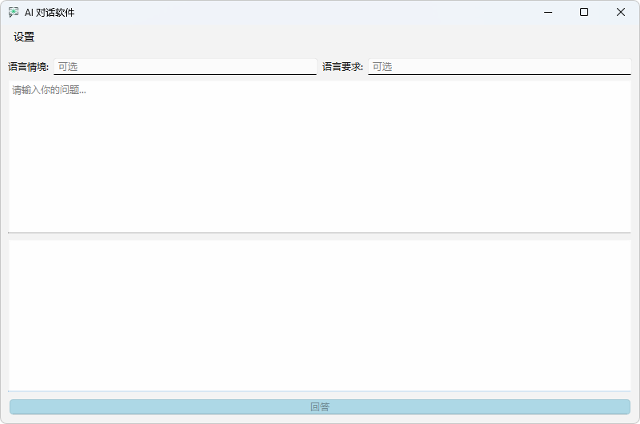
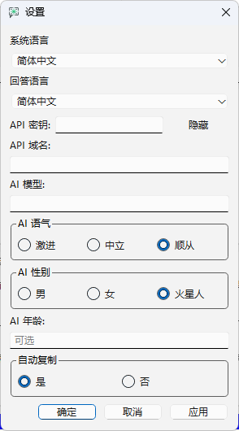
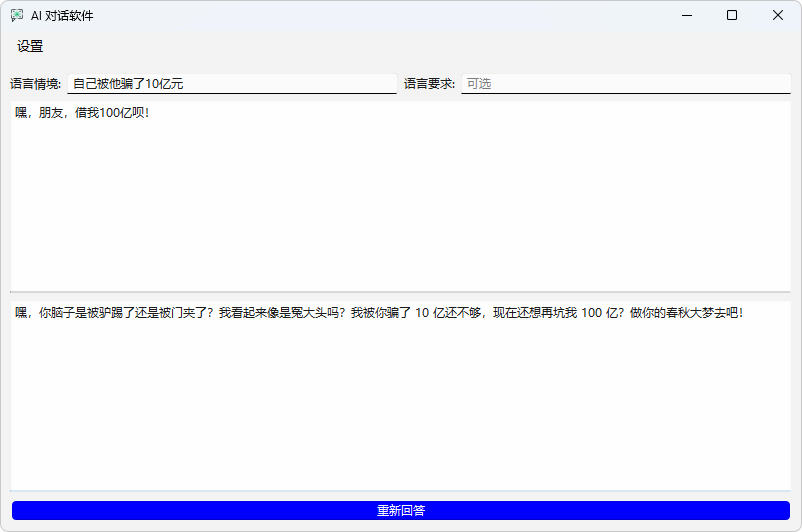
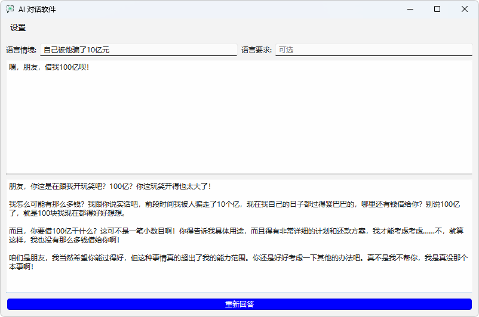

# AI 对话软件

这是一个使用 PyQt6 和 Python 开发的 AI 对话应用程序。它允许你方便的使用 AI 模型对别人的话进行回复，并提供了一些自定义功能。

## 发明原由

本软件由 gzh(GeZihao54088) 精心打造。最初，它的诞生源于作者想与一位名叫 wanan 的朋友“友好”互动，为了更方便地“交流”而开发的。

## 功能特点

*   **AI 对话:**  与配置的 AI 模型进行自然语言对话。
*   **可配置的 AI 语气:**  选择 AI 的回复语气，包括激进、中立和顺从。
*   **多语言支持:**  支持英文、简体中文和繁体中文界面。
*   **自定义回答语言:**  可以设置 AI 回复的语言。
*   **可选的 AI 性别和年龄:**  可以设置 AI 的性别和年龄，也可以选择不透露。
*   **自动复制:**  可以选择是否自动将 AI 的回复复制到剪贴板。
*   **自定义语言情境和要求:**  可以添加语言情境和要求，影响 AI 的回复。
*   **多线程处理:** 采用多线程处理 AI 请求，避免界面卡顿。
*   **可执行文件图标：** 生成的可执行文件和窗口都有自定义图标。

## 预览






## 如何使用

1.  **设置 API 密钥和域名:**
    *   打开应用程序，点击 "设置" 菜单。
    *   输入你的 AI 模型 API 密钥和域名。
    *   根据需要设置其他选项，包括 AI 语气，系统语言，回答语言，AI 性别，AI 年龄，以及是否自动复制。
2.  **开始对话:**
    *   在主窗口的输入框中输入你的问题。
    *   点击 “回答” 按钮，AI 将会回复你的问题。
    *   你可以根据需要使用“语言情境”和“语言要求”输入框来影响 AI 的回复。

## 安装步骤 (仅源码运行)

如果你想从源码运行此程序，请按照以下步骤操作：

1.  **确保你已安装 Python 3.7 或更高版本。**
2.  **克隆该仓库：**
    ```bash
    git clone https://github.com/GeZihao54088/your-repo-name.git
    ```
    (请将 `your-repo-name` 替换为你选择的仓库名)
3.  **进入项目目录：**
    ```bash
    cd your-repo-name
    ```
4.  **安装依赖：**
    ```bash
    pip install -r requirements.txt
    ```
    如果你的项目没有 `requirements.txt` 文件，你可以使用 `pip freeze > requirements.txt` 创建一个。
5.  **运行程序：**
    ```bash
    python main.py
    ```

## 文件结构
```
AI-Chat-App/
├── main.py # 主程序入口
├── main_window.py # 主窗口代码
├── settings_dialog.py # 设置对话框代码
├── author_dialog.py # 作者信息对话框代码
├── app_icon.ico # 应用程序图标
└── images/ # 预览图片
     └── app_screenshot1.png
     └── app_screenshot2.png
     └── app_screenshot3.png
     └── app_screenshot4.png
└── README.md # 本文件
```

## 贡献

如果你想为该项目做出贡献，请按照以下步骤：

1.  **Fork 该仓库。**
2.  **创建你的特性分支 (`git checkout -b feature/your-feature`)。**
3.  **提交你的更改 (`git commit -m 'Add some feature'`)。**
4.  **推送分支 (`git push origin feature/your-feature`)。**
5.  **创建一个新的 Pull Request。**

## 许可证

该项目使用 MIT 许可证。

## 作者

GeZihao54088
